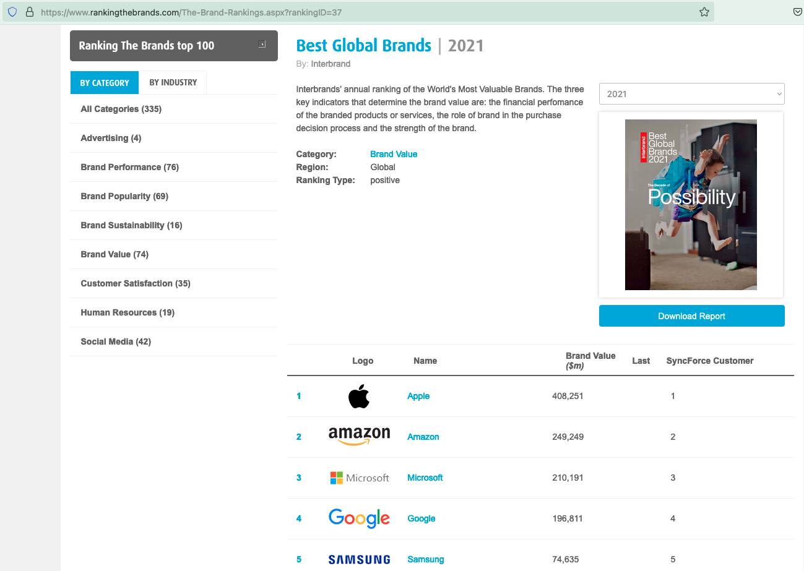

# Web scraper for rankingthebrands.com

## Purpose

The purpose of this Jupyter notebook is to capture data from RankingTheBrands.com's "Best Global Brands" for the years 2007 - 2022.

To collect the data, we repeatedly visit the website for RankingTheBrands, for each year. Subsequently, we parse the data from the ranking table (as seen on the screenshot below).

The data is saved as a flattened CSV file, as well as an Excel file w/ yearly data in individual tabs.

## Installation instructions

### Running the scraper in the cloud
In the cloud Go to colab.google.com, and import this Notebook (.ipynb). Click on "Run". The output data will be stored on Google Colab.

### Running the scraper locally

It is recommended to install Jupyter Notebook via the Anaconda distribution.

1. Go to the https://www.anaconda.com/products/distribution link and install Anaconda on your computer.
2. Place this file ([`webscraping_ranking_the_brands.ipynb`](webscraping_ranking_the_brands.ipynb)) on your Desktop, or any other folder of your choice.
3. Open Anaconda Navigator, and launch Jupyter Notebook (which launches in your browser).
4. Go to the folder that you placed the `.ipynb` source code
5. Run the code by clicking on Cell --> Run cells.

[__View source code here__](webscraping_ranking_the_brands.ipynb).

## Final data sets

The final data sets have been committed to this repository.

- [Excel file](rankingthebrands.xlsx)
- [CSV file](rankingthebrands.csv)
- [Excel file w/ data in tabs per year](rankingthebrands_in_tabs.xlsx)
